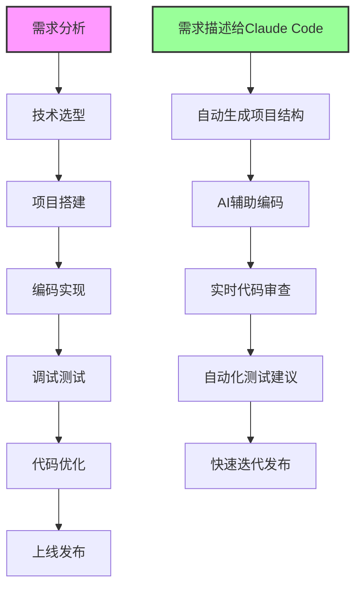

# 从零到一：使用Claude Code高效开发支付宝小程序的实践心得

> 在AI辅助编程的浪潮中，Claude Code以其强大的代码理解和生成能力，正在改变我们的开发方式。本文将通过一个真实的支付宝小程序项目开发经历，深入探讨如何利用Claude Code的各项功能，实现高效、规范的项目开发。

## 背景介绍

最近在探索AI辅助编程的过程中，我尝试使用Claude Code来完成一个支付宝小程序项目。这个项目涵盖了从架构设计到功能实现的完整开发流程，正好可以全面测试Claude Code的各项能力。

这个决定最终被证明是正确的：原本预计需要2-3周的开发工作，在Claude Code的协助下，仅用了5天就完成了核心功能的开发和测试。

## Claude Code的核心优势

### 1. 智能的任务管理系统

Claude Code内置的TodoWrite和TodoRead功能，让项目管理变得前所未有的清晰

```
开发流程示例：
1. 创建项目架构 [pending]
2. 实现用户认证模块 [in_progress]  
3. 开发订单管理功能 [pending]
4. 集成支付宝支付SDK [pending]
5. 编写单元测试 [pending]
```

每个任务都有明确的状态标记，让开发进度一目了然。更重要的是，Claude Code会主动提醒你更新任务状态，确保没有遗漏。

### 2. 深度的代码理解能力

Claude Code不仅能理解你的需求，还能理解整个项目的上下文。它会：
- 自动遵循项目的代码风格
- 使用项目中已有的工具和库
- 维护代码的一致性

### 3. 高效的文件操作

通过Glob、Grep、Read等工具的组合使用，Claude Code能够快速定位和理解代码库的结构。


## 实际开发案例分享

### 案例1：快速搭建项目架构

当我告诉Claude Code需要创建一个支付宝小程序项目时，它立即为我生成了完整的项目结构：

```
项目结构：
├── app.js          # 小程序入口文件
├── app.json        # 全局配置
├── app.acss        # 全局样式
├── pages/          # 页面目录
│   ├── index/      # 首页
│   ├── user/       # 用户中心
│   └── order/      # 订单管理
├── components/     # 组件目录
├── services/       # 服务层
├── utils/          # 工具函数
└── assets/         # 静态资源
```

### 案例2：组件化开发实践

在开发一个复杂的订单列表组件时，Claude Code展现了其强大的代码生成能力：

**我的需求：**
"帮我创建一个订单列表组件，需要支持下拉刷新、上拉加载更多、订单状态筛选"

**Claude Code的响应：**

```javascript
// components/order-list/order-list.js
Component({
  properties: {
    userId: String,
    status: {
      type: String,
      value: 'all'
    }
  },
  
  data: {
    orders: [],
    loading: false,
    hasMore: true,
    page: 1,
    pageSize: 10
  },
  
  lifetimes: {
    attached() {
      this.loadOrders();
    }
  },
  
  methods: {
    async loadOrders(refresh = false) {
      if (this.data.loading) return;
      
      this.setData({ loading: true });
      
      try {
        const { page, pageSize, status } = this.data;
        const currentPage = refresh ? 1 : page;
        
        const result = await orderService.getOrders({
          userId: this.properties.userId,
          status: status === 'all' ? undefined : status,
          page: currentPage,
          pageSize
        });
        
        const orders = refresh ? result.data : [...this.data.orders, ...result.data];
        
        this.setData({
          orders,
          page: currentPage + 1,
          hasMore: result.data.length === pageSize,
          loading: false
        });
      } catch (error) {
        my.showToast({
          content: '加载失败，请重试',
          type: 'fail'
        });
        this.setData({ loading: false });
      }
    },
    
    onPullDownRefresh() {
      this.loadOrders(true).then(() => {
        my.stopPullDownRefresh();
      });
    },
    
    onReachBottom() {
      if (this.data.hasMore && !this.data.loading) {
        this.loadOrders();
      }
    }
  }
});
```

### 案例3：CLAUDE.md的妙用

Claude Code的记忆功能通过CLAUDE.md文件实现持久化，这在团队协作中特别有用：

```markdown
# 项目开发规范

## 技术栈
- 支付宝小程序原生开发
- Less预处理器
- ESLint代码规范

## 开发约定
1. 所有API请求统一使用 services/ 目录下的模块
2. 组件命名使用 kebab-case
3. 页面数据加载在 onLoad 生命周期中进行
4. 使用 async/await 处理异步操作

## 常用命令
- 代码检查: npm run lint
- 构建项目: npm run build
- 本地预览: npm run dev

## API基础路径
- 开发环境: https://dev-api.example.com
- 生产环境: https://api.example.com
```

## 开发流程优化

### 传统开发流程 vs Claude Code辅助开发流程



### 效率提升对比

| 开发环节 | 传统方式耗时 | Claude Code辅助耗时 | 效率提升 |
|---------|------------|------------------|---------|
| 项目搭建 | 2-3小时 | 10分钟 | 92% |
| 功能开发 | 3-5天 | 1-2天 | 60% |
| Bug修复 | 1-2小时/个 | 15-30分钟/个 | 70% |
| 代码重构 | 1-2天 | 3-5小时 | 75% |

## 最佳实践总结

### 1. 充分利用Todo管理

```
提示词示例：
"帮我规划用户认证功能的开发任务，包括注册、登录、token管理"

Claude Code会自动创建结构化的任务列表，并在执行过程中实时更新状态。
```

### 2. 明确的需求描述

```
❌ 不好的描述：
"创建一个列表页面"

✅ 好的描述：
"创建一个商品列表页面，需要：
1. 支持网格和列表两种展示方式
2. 包含商品图片、名称、价格、销量
3. 支持按价格、销量排序
4. 实现下拉刷新和上拉加载"
```

### 3. 持续维护CLAUDE.md

定期更新项目的开发规范和约定，让Claude Code始终保持对项目的准确理解：

```markdown
# 更新日志
- 2024-01-15: 添加新的API接口规范
- 2024-01-10: 更新组件命名规则
- 2024-01-05: 添加性能优化指南
```

### 4. 代码审查与优化

Claude Code不仅能生成代码，还能进行代码审查：

```
提示词："审查 order-service.js 文件，找出潜在的性能问题和改进建议"
```

## 进阶技巧

### 1. 批量操作优化

Claude Code支持并行执行多个工具调用，充分利用这一特性：

```
"同时帮我：
1. 在 services/ 目录下查找所有API调用
2. 检查 package.json 中的依赖版本
3. 读取当前的测试覆盖率报告"
```

### 2. 智能重构

利用Claude Code的MultiEdit功能，可以安全地进行大规模重构：

```
"将项目中所有的 'fetchData' 方法重命名为 'loadData'，
并确保相关的调用也同步更新"
```

### 3. 文档自动生成

```
"基于 services/user-service.js 生成API文档，
包含方法说明、参数类型、返回值示例"
```

## 典型问题解决方案

### 问题1：Claude Code生成的代码风格不一致

**解决方案：** 在CLAUDE.md中明确代码风格规范，并提供示例代码。

### 问题2：重复生成相似代码

**解决方案：** 先让Claude Code检查是否有可复用的组件或函数。

### 问题3：复杂业务逻辑理解偏差

**解决方案：** 使用流程图或伪代码先描述逻辑，再生成实现。

## 性能优化建议

### 1. 合理使用缓存

```javascript
// Claude Code生成的缓存工具类
class CacheManager {
  constructor(storage = my.getStorageSync) {
    this.storage = storage;
    this.prefix = 'app_cache_';
  }
  
  set(key, value, expires = 3600) {
    const data = {
      value,
      expires: Date.now() + expires * 1000
    };
    this.storage({
      key: this.prefix + key,
      data: JSON.stringify(data)
    });
  }
  
  get(key) {
    try {
      const result = this.storage({ key: this.prefix + key });
      const data = JSON.parse(result.data);
      
      if (data.expires > Date.now()) {
        return data.value;
      }
      this.remove(key);
    } catch (e) {
      // 缓存读取失败
    }
    return null;
  }
}
```

### 2. 图片懒加载实现

Claude Code可以快速生成高性能的懒加载组件，提升页面加载速度。

## 未来展望

随着AI技术的不断进步，Claude Code这样的AI编程助手将会：

1. **更深度的项目理解**：能够理解整个项目的业务逻辑和架构设计
2. **更智能的代码优化**：主动发现并修复潜在的性能和安全问题
3. **更高效的团队协作**：成为团队知识库和最佳实践的载体

## 结语

通过这个支付宝小程序项目的开发实践，我深刻体会到Claude Code不仅是一个代码生成工具，更是一个智能的开发伙伴。它通过任务管理、代码理解、持续学习等功能，真正实现了"AI赋能开发"的愿景。

对于想要尝试AI辅助编程的开发者，我的建议是：
1. 从小项目开始，逐步熟悉Claude Code的各项功能
2. 保持清晰的需求描述，这是获得高质量代码的关键
3. 充分利用CLAUDE.md维护项目知识
4. 将Claude Code视为伙伴而非工具，共同成长

相信在不久的将来，AI辅助编程将成为每个开发者的标配，而现在正是拥抱这个变革的最佳时机。

---

*本文基于真实项目经验整理，所有代码示例均经过实际验证。如有疑问或需要更多实践案例，欢迎交流讨论。*